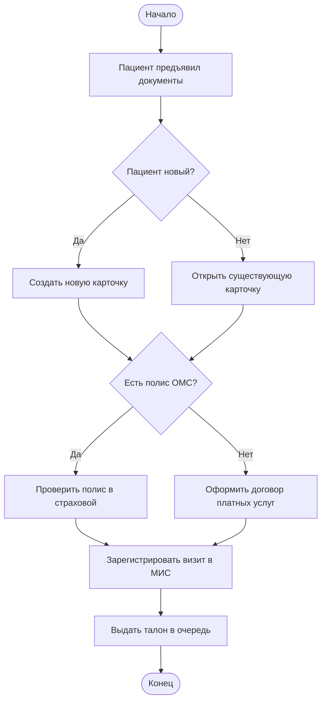

# Flowchart — Алгоритм регистрации пациента

```mermaid
flowchart TD
    Start([Начало]) --> A[Пациент предъявил документы]
    A --> B{Пациент новый?}

    B -- Да --> C[Создать новую карточку]
    B -- Нет --> D[Открыть существующую карточку]

    C --> E{Есть полис ОМС?}
    D --> E

    E -- Да --> F[Проверить полис в страховой]
    E -- Нет --> G[Оформить договор платных услуг]

    F --> H[Зарегистрировать визит в МИС]
    G --> H

    H --> I[Выдать талон в очередь]
    I --> End([Конец])
```

