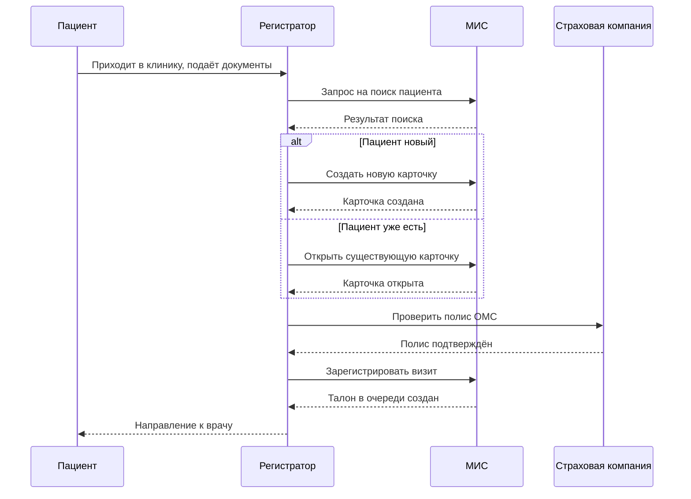

# Sequence Diagram — Регистрация пациента в клинике

```mermaid
sequenceDiagram
    participant P as Пациент
    participant R as Регистратор
    participant M as МИС
    participant S as Страховая компания

    P->>R: Приходит в клинику, подаёт документы
    R->>M: Запрос на поиск пациента
    M-->>R: Результат поиска

    alt Пациент новый
        R->>M: Создать новую карточку
        M-->>R: Карточка создана
    else Пациент уже есть
        R->>M: Открыть существующую карточку
        M-->>R: Карточка открыта
    end

    R->>S: Проверить полис ОМС
    S-->>R: Полис подтверждён

    R->>M: Зарегистрировать визит
    M-->>R: Талон в очереди создан
    R-->>P: Направление к врачу
```

